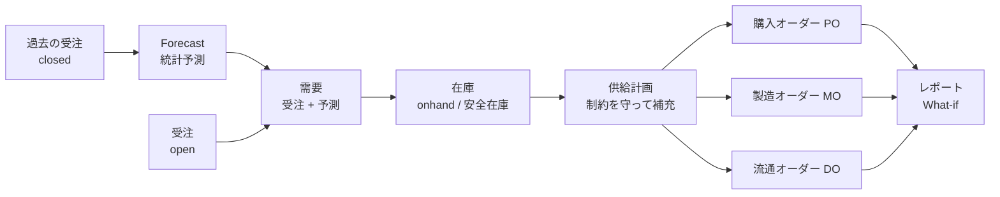

この章のゴール: frePPLe が何を入力として、どんな計画を出すのかを一枚の地図にして、この本のどの章で何を触るかを把握する。

:::message
**この章で学べる計画の考え方**

- 計画は「需要 → 在庫 → 補充（買う・作る・運ぶ）」の順につながっている
- 補充手段は 3 種類ある。購入（PO）、製造（MO）、流通（DO）
- frePPLe の機能は 4 つの領域（Forecast / Inventory / Distribution / Production）に分けて考えると整理しやすい
:::

手を動かす前に、全体の地図を見ておきます。細かい操作は 3 章以降で順に出てくるので、この章は「どこに何があるか」を知るつもりで読んでください。

## 計画は何を決める仕事か

生産計画（供給計画）は、「受注に間に合うように、いつ・何を・どれだけ、買う・作る・運ぶか」を決める仕事です。難しいのは、次の 3 つが同時に効くからです。

- **リードタイム**: 発注してから届くまで、着手してから終わるまでに時間がかかる。納期から逆算して、早めに動く必要がある。
- **能力**: 機械や人には、同時にこなせる量に上限がある。
- **在庫と部品表**: 完成品を 1 個作るには、部品が何個いるか決まっている。部品が足りなければ作れない。

たとえば、納期が 5 日後で、材料が届くのに 3 日かかり、組み立てに 2 日かかるなら、今日が発注の期限です。こうした逆算を、受注・部品・設備のすべてについて行うのが計画システムの役割です。この本は、その仕組みを、実際に動かして確かめます。

## 計画の流れ

frePPLe は、需要（これから何がどれだけ必要か）と、供給の仕組み（どこで何を作り・買い・運べるか）の両方を入力にします。そこから、需要を満たすためのオーダーを自動で作ります。

- **需要** は、確定した受注（`open`）と、将来の予測（Forecast）の合計です。受注が予測を消費して、二重に数えないようにする仕組みもあります（13 章）。
- **在庫** は、品目と拠点の組み合わせ（`buffer`）ごとに持ちます。現在庫と安全在庫が、計画の起点と目標になります（11 章）。
- **供給計画** が、在庫を目標どおりに保ちながら需要を満たすために、買う・作る・運ぶを決めます。能力やリードタイムを守る（制約あり）か、守らない（制約なし）かを選べます（7 章）。

## 4 つの領域

この本では、frePPLe の機能を次の 4 つの領域に分けて扱います。

| 領域 | 決めること | 主な入力 | 結果と画面 | この本の章 |
|---|---|---|---|---|
| **Forecast** | 将来の需要はどれくらいか | 過去の受注（`closed`）、予測の設定（forecast） | 統計予測、受注による消費後の正味予測（予測レポート / 予測エディタ） | 13 章 |
| **Inventory** | 品目×拠点の在庫の目標と、補充の単位 | 現在庫、安全在庫（buffer）、発注の最小・倍数（商品供給者） | 在庫の推移（棚卸レポート） | 6 章、11 章 |
| **Distribution** | 拠点間で何をいつ運ぶか | 輸送の条件（商品流通）、地域（location） | 流通オーダー（DO）、Distribution order summary | 10 章 |
| **Production** | 何をいつ作る・買うか | 部品表、作業、リソース、供給者、販売オーダー | 製造オーダー（MO）、購入オーダー（PO）、資源レポート、条件レポート | 5〜9 章、12 章 |

4 つは独立した機能ではありません。たとえば、倉庫向けの予測（Forecast）が、倉庫の在庫（Inventory）の目標を動かし、工場から倉庫への輸送（Distribution）と、工場での製造（Production）を引き起こします。

## frePPLe に入れるデータ

入力データは、次のような「表」の集まりです。用語は巻末の用語集（15 章）にまとめています。

| 分類 | 主な表 |
|---|---|
| 需要 | 販売オーダー（demand）、予測（forecast）、顧客（customer） |
| 品目と拠点 | 商品（item）、地域（location） |
| 在庫 | バッファ（buffer） |
| 購入 | 供給者（supplier）、商品供給者（item supplier） |
| 製造 | 作業（operation）、作業材料（operation material）、リソース（resource）、カレンダー |
| 流通 | 商品流通（item distribution） |

データは、画面のグリッドで入力するほか、Excel/CSV のインポートや REST API でも登録できます（5 章）。公式ドキュメントによると、ERP とつなぐ仕組み（Odoo などのコネクタ）もあります。この本では、ERP との連携は扱いません。

## 計画エンジンの考え方

frePPLe の計画エンジンには、この本で繰り返し出てくる考え方があります。

- **制約なし／制約あり**: 能力やリードタイムを無視して「理想の計画」を作るか、守って「実行できる計画」を作るか（6 章、7 章）。
- **優先度**: 能力が足りないとき、どの受注を先に満たすか（8 章）。
- **オーダーの status**: 計画エンジンの提案（`proposed`）と、人が確定したもの（`confirmed`）の違い（8 章）。
- **What-if**: データを複製して条件を変え、結果を比べる（9 章）。

## Edition の違い

frePPLe には Community / Cloud / Enterprise の 3 つの Edition があります。この本で使うのは、MIT ライセンスの **Community Edition** です。

| 機能 | Community 9.17.0（この本の環境） |
|---|---|
| Forecast（統計予測、予測の消費） | 使える。有効になっていて、実行画面の「予測を作成」（Generate forecast）で実行できることを確認しました（13 章） |
| 在庫計画（サービスレベルから安全在庫と発注量を自動計算） | **入っていません**。アプリ（`inventoryplanning`）がなく、メニューもありません。11 章で概念だけ説明します |
| 在庫の基本設定（現在庫、安全在庫、発注の最小・倍数） | 使える（11 章） |
| 配送（拠点間の輸送） | 使える（10 章） |
| 対話的なガントチャート（Plan editor） | この本では扱いません。Community では、閲覧専用の Demand Gantt report を使います（12 章） |

公式サイトの editions ページは、Cloud / Enterprise の追加機能として、在庫計画の最適化、対話的なガントチャート、納期の見積もり（due date quoting）、段取りマトリクスの最適化、賞味期限を考慮した計画を挙げています。この本では、上の表に書いた項目だけを、自分の環境で確認しました。それ以外は確認していません。

:::message
公開デモ（3 章）は Enterprise 相当の画面です。Community の画面とは、機能や見た目が少し違います。
:::

## この本の歩き方

どの章で何を扱うかは、1 章の「進め方」の表にあります。4 つの領域は、Production（5〜9 章）を土台に、配送（10 章）、在庫（11 章）、需要予測（13 章）を足していきます。

## つまずきポイント

- 4 領域のうち、どれから読めばよいか迷う: 5〜9 章（Production）が土台です。10 章以降は、その上に配送・在庫・需要予測を足す章なので、9 章まで読んでからにしてください。
- 画面のメニューに Forecast や Inventory planning が見つからない: Forecast は Community にもあります（`/forecast/`）。Inventory planning は Community にありません。
