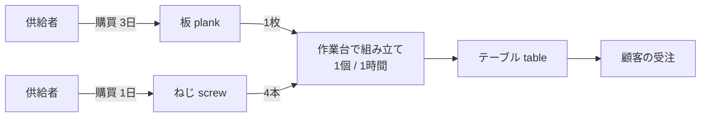

この章のゴール: 空のデータベースに、テーブル 1 種類だけを作る小さな工場のモデルを自分で登録する。以降の章（5〜9、10〜11、14 章）は、このモデルを土台にします。

:::message
**この章で学べる計画の考え方**

- 需要 → 部品表 → 工程 → リソース → 購買、というモデル化の順序
- 補充手段（作る・買う）がない品目は計画できない
- 能力が足りない状況を、意図的に作る
:::

デモデータは多くの品目と工程が入っていて、結果を予想しにくいものです。この本では、先に小さなモデルを自分で作り、計画の結果を予想しながら読んでいきます。デモデータは 12 章で使います。

## 作るモデル

**「テーブル」を 1 種類だけ作る小さな工場** を考えます。

- テーブル 1 個は、板 1 枚とねじ 4 本から作る。
- 組み立ては作業台（workbench）で 1 個あたり 1 時間かかる。作業台は 1 台で、同時に 1 個しか組み立てられない。
- 板は発注から 3 日、ねじは 1 日で届く。

受注は 3 件で、合計 300 個です。作業台は 1 日 24 時間使えるものとしても、300 個には 300 時間（12.5 日）かかります。**能力が足りない** ように、わざとこの設定にしています。7 章の制約あり計画を、自分で作ったデータで体験するためです。

## データを空にする

起動時に入ったデモデータが混ざるので、いったん消します。

1. 管理（Admin）メニューの **実行**（Execute）を開く。
2. 「Clear all data」のカード（未訳で英語のまま）を開く。
3. 何も変えずに **起動**（Launch）を押す。

このカードは、既定で「DATA TABLES」（品目・受注・オーダーなどのデータ）だけにチェックが入っています。「ADMIN TABLES」（ユーザー、パラメータなど）にはチェックが入っていません。この状態のままにしてください。パラメータ（計画基準日 `currentdate` など）、期間の軸（バケット）、ユーザーは残ります。

## 計画基準日を確認する

管理メニューの **パラメーター**（Parameters）で `currentdate` を確認します。`today`（実行日）になっているはずです。以降の受注の納期は、基準日からの日数で書くので、基準日を **D0** とします。

## データを登録する

登録の順番が大切です。**「参照される側」から先に** 登録します。メニューは、依存するデータがあるときにだけ現れる仕組みです（4 章の注意点）。

:::message
データ入力は、一覧画面のグリッド（表）で行を追加するか、Excel/CSV のインポートで一括して行えます。作業（operation）の所要時間は、`01:00:00`（1 時間）、`3 00:00:00`（3 日）の形式です。

画面で 1 件ずつ入力する代わりに、次の 1〜5 をまとめて登録するスクリプトを `examples/frepple-api/setup-model.sh` に置いています。`./setup-model.sh` を実行するだけです。画面で登録した場合は不要です。
:::

### 1. 拠点・顧客・品目

| 販売（Sales）メニュー | 登録する内容 |
|---|---|
| 地域（Locations） | `factory` |
| 顧客（Customers） | `customer A` |
| 商品（Items） | `table`、`plank`、`screw` |

### 2. 供給者と調達条件

購入（Purchasing）メニューの **供給者**（Suppliers）に `lumber shop` を登録します。続いて **商品供給者**（Item suppliers）で、どの品目をどの供給者から買えるかを登録します。

| 商品 | 地域 | 供給者 | リードタイム |
|---|---|---|---|
| plank | factory | lumber shop | 3 日 |
| screw | factory | lumber shop | 1 日 |

「リードタイム」（`leadtime`）は調達リードタイム（発注から届くまでの日数）です。

### 3. リソース（作業台）

能力（Capacity）メニューの **リソース**（Resources）に登録します。

| 名前 | 地域 | 最大 |
|---|---|---|
| workbench | factory | 1 |

「最大」（`maximum`）は同時に扱える量です。1 なら、同時に 1 つの作業しかできません。

### 4. 作業（operation）と部品表（BOM）

製造（Manufacturing）メニューの **作業**（Operations）に、作業を登録します。

| 名前 | 種類 | 商品 | 地域 | 単位ごとにかかる時間 |
|---|---|---|---|---|
| Make table | time_per | table | factory | 1 時間 |

`time_per` は、数量に比例して時間がかかる作業です。「商品」は、この作業が作る品目です。

次に **作業材料**（Operation materials）で、材料の消費を登録します。**消費は負の数** で書きます。

| 作業 | 商品 | 数量 | 種類 |
|---|---|---|---|
| Make table | plank | -1 | start |
| Make table | screw | -4 | start |

`table` を作る側（`end` で生産）は、作業の「商品」から暗黙に決まるので、登録は不要です。

最後に **作業リソース**（Operation resources）で、この作業が使うリソースを登録します。

| 作業 | リソース | 数量 |
|---|---|---|
| Make table | workbench | 1 |

### 5. 受注（demand）

販売メニューの **販売オーダー**（Sales orders）に、3 件の受注を登録します。「納期」は基準日 D0 からの日数で表します。

| 名前 | 商品 | 地域 | 顧客 | 数量 | 納期 |
|---|---|---|---|---|---|
| order 1 | table | factory | customer A | 100 | D0 + 5 日 |
| order 2 | table | factory | customer A | 100 | D0 + 6 日 |
| order 3 | table | factory | customer A | 100 | D0 + 7 日 |

「ステータス」は `open`（オープン）にします。「優先順位」は既定値（10）のままで構いません。

## 次の章へ

これでモデルは完成です。6 章で計画を立てます。その前に、次の 2 点を予想しておくと、結果が読みやすくなります。

- 作業台は 1 台です。3 件の受注を、納期どおりに納品できるでしょうか。
- 板は発注から 3 日で届きます。今日から数えて 5 日後の納期に、間に合うでしょうか。

## つまずきポイント

- 販売オーダーのメニューが出てこない: 商品・地域・顧客のどれかが未登録です。
- 所要時間の単位に迷う: 「単位ごとにかかる時間」（`duration_per`）は「1 個あたり」の時間です。「かかる時間」（`duration`）は数量に関係ない固定の時間です。
- 登録で `Invalid pk ... does not exist` と出る: 参照先の拠点・品目が未登録です。登録の順番を確認してください。

公式ドキュメントの参照先: `model-reference/item-suppliers`、`resources`、`operations`、`operation-materials`、`sales-orders`、`user-interface/getting-around/importing-data`。
