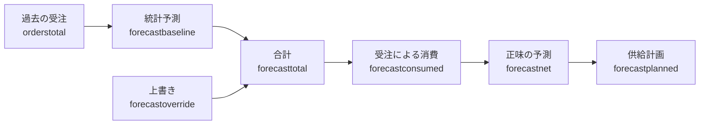

この章のゴール: 過去の受注から統計予測を作り、受注による消費を経て、予測が製造・購買の計画に入るまでを、デモデータで一通り確認する。

:::message
**この章で学べる計画の考え方**

- 統計予測は、過去の受注（実績）から作る
- 受注が入ると予測を「消費」する。予測と受注を二重に数えないための仕組み
- 予測は、計画に入れるかどうかで、製造・購買の量が大きく変わる
- 計画担当者は、統計予測を上書きして、販促などの情報を足せる
:::

2 章で見たとおり、Forecast は Community Edition にも入っています。この章は、12 章で読み込んだ `manufacturing_demo` を使います。

## 予測から計画までの流れ



それぞれの値は、品目・拠点・顧客・期間（バケット）ごとに持ちます。公式ドキュメント `model-reference/forecast-measures` による、各値の意味は次のとおりです。

| 値（measure） | 意味 |
|---|---|
| `orderstotal` | 過去の受注の数量。統計予測の入力になる |
| `forecastbaseline` | 統計予測の結果 |
| `forecastoverride` | 計画担当者が書き込む上書き値 |
| `forecasttotal` | 計画に使う予測の総量。上書きがなければ統計予測、あれば上書き値 |
| `forecastconsumed` | 未処理の受注（`open`）が消費した分 |
| `forecastnet` | 消費後に残った予測。計画の対象になる |
| `forecastplanned` | 供給計画が実際に計画した予測の数量 |

## データを用意する

`manufacturing_demo` を、既存のデータを消してから読み込み直します。前の章で作ったデータは消えます。12 章と同じく、実行画面の「データセットをロード」（Load a dataset）で、「Purge all data before loading」にチェックを入れ、「Execute plan after loading」は外して実行します（この 2 つは未訳で英語のままです）。

Web API なら、次のようにします。

```bash
curl -u admin:admin -X POST "http://localhost:9000/execute/api/loaddata/" \
  --data "fixture=manufacturing_demo&emptybefore=true&regenerateplan=false"
```

:::message alert
12 章で紹介した `frepplectl loaddata manufacturing_demo` は、既存のデータを **消しません**。手元では、5 章のモデルが残った状態で実行すると、受注が 4 件から 224 件に増え、`table` や `workbench` も残りました。5 章のデータがあるときは、上の画面か Web API を使ってください。
:::

このデータには、受注が 220 件あります。うち 204 件は `closed`（過去の実績）で、これが統計予測の元になります。

販売メニューの **予測**（Forecast。`/data/forecast/forecast/`）を開くと、予測の設定が 24 行あります。予測レポートとは別の、設定の一覧です。品目（chair、round table、square table、varnished chair）×拠点（shop 1、shop 2、warehouse）×顧客の組み合わせです。

予測の設定は、デモデータのように最初から入れておく必要はありません。パラメータ `forecast.populateForecastTable` が `true`（既定）なら、過去の受注にある「品目・拠点・顧客」の組み合わせから、自動で作られます（公式ドキュメント `examples/forecasting/forecast-method`）。

## 予測を実行する

実行画面の「計画を作成」カードで、**予測を作成**（Generate forecast）にもチェックを入れて実行します。6 章では、このチェックをオフのままにしていました。

```bash
./plan.sh "plantype=1&constraint=capa,mfg_lt,po_lt&env=fcst,supply"
```

`env=fcst` が「予測を作成」、`env=supply` が「サプライチェーンを生成」です。手元では 6 秒で終わりました。計画のログには、次の段階が出ます。

- `Load forecast`（予測の設定を読み込む）
- `Calculate statistical forecast and forecast consumption`（統計予測と、受注による消費を計算する）

:::message
「予測を作成」をオフにして実行すると、統計予測と消費は再計算されず、前回の値が使われます。手元では、`env=supply` だけで実行しても、前回の予測が計画に入っていました。
:::

## 予測の方法と精度

予測の方法（`method`）は、既定で `automatic` です。frePPLe が複数の方法を試して、予測の誤差が小さいものを選びます。選ばれた方法は `out_method`、誤差（SMAPE）は `out_smape` に入ります。この 2 つは、計画を実行するまでは入っていません（読み込み直後は、24 行のうち `out_smape` は 0 行、`out_method` は 7 行だけでした）。手元の実行後の例です。

| 品目 @ 拠点（All customers） | 選ばれた方法 | SMAPE（%） |
|---|---|---|
| chair @ shop 1 | constant | 7.93 |
| chair @ shop 2 | constant | 26.51 |
| round table @ shop 1 | constant | 34.36 |
| square table @ shop 1 | constant | 24.00 |
| chair @ warehouse | intermittent | 94.38 |
| square table @ warehouse | intermittent | 100.00 |

方法の意味は、公式ドキュメントでは次のように説明されています。

| 方法 | 向いているデータ |
|---|---|
| constant | 需要が時間でほぼ変わらない |
| trend | 増加または減少の傾向がある |
| seasonal | 季節による周期がある |
| intermittent | 売れない期間（ゼロ）が多い |
| moving average | 履歴が短い（新しい品目など） |
| manual | 統計予測を計算しない。上書きだけで予測を与える |

SMAPE は、値が小さいほど、予測が過去の実績に近いことを表します。倉庫向けの `intermittent` は、実績がまばらなため、誤差が大きくなっています。

誤差は、公式ドキュメント `a-day-in-the-life/demand-forecasting/check-forecast-accuracy` によると、予測エディタの下の方のパラメータの枠、ホーム画面の予測誤差の推移のウィジェット、予測レポートの誤差の項目でも見られます。この本では、`out_smape` の値を、API とデータベースから読みました。

## 予測レポートを読む

販売メニューの **予測レポート**（Forecast report。`/forecast/`）を開きます。品目・拠点・顧客を絞り込んで、期間ごとの値を見ます。手元の `chair @ shop 1 @ All customers` の例です（月ごとの数量。基準日は 10 月初め）。

| 月 | 過去の受注（orderstotal） | 統計予測（baseline） | 合計（total） | 消費（consumed） | 正味（net） |
|---|---|---|---|---|---|
| 7 月 | 220 | | | | |
| 8 月 | 210 | | | | |
| 9 月 | 204 | | | | |
| 10 月 | 40（`open` の受注） | 206 | 206 | 40 | 166 |
| 11 月 | 10（`open` の受注） | 206 | 206 | 10 | 196 |
| 12 月 | | 207 | 207 | | 207 |
| 1 月 | | 206 | 206 | | 206 |

- 過去の月（7〜9 月）は実績だけで、予測はありません。
- 10・11 月は、未処理の受注が予測の一部を消費して、正味が小さくなっています。**正味 = 合計 − 消費** です。
- 12 月以降は受注がまだないので、予測がそのまま正味になります。

予測の消費は、「受注 + 予測」をそのまま計画すると、同じ需要を二重に数えてしまうのを避ける仕組みです。公式ドキュメント `examples/forecasting/forecast-netting` に、丸テーブルの例があります（1 月の予測 350、受注 130 なら、正味は 220）。

受注が、前後の月の予測を消費できるかどうかは、パラメータ `forecast.Net_NetEarly` と `forecast.Net_NetLate` で決まります。手元の値は、どちらも 0（同じ月の予測だけを消費）でした。

:::message
デモデータは、読み込んだ日を基準に日付がずれます。さらに、統計予測は実績の月の並びから計算されるため、読み込む日によって、選ばれる方法や数値が変わります。手元でも、別の日に読み込んだデータでは `chair @ shop 1` が `trend`（SMAPE 7.55）になりました。表の数値は目安として読んでください。
:::

## 予測は計画にどう効くか

供給計画は、受注と、**正味の予測** の両方を満たすように作られます。ただし、予測が計画の対象になるのは、予測の設定の `planned` が `true` の行だけです。デモデータでは、顧客が `All customers` の行（12 行）が `true` です。

同じデモデータで、`All customers` の行を `planned = false`（受注だけを計画する）にして、制約あり計画をやり直し、製造数量を比べました。

REST API（`/api/forecast/forecast/`）には `planned` の項目がなく、手元では `PATCH` しても変わりませんでした。画面で変える操作は確認していないので、データベースを直接書き換えています。学習用のローカル環境だけで行い、業務のデータには使わないでください。この節と次の「統計予測を上書きする」の SQL は、効果を確かめる実験として読んでください。

```bash
docker exec frepple-community-postgres psql -U frepple -d frepple0 -c \
  "update forecast set planned=false where name like '% @ All customers'"
./plan.sh "plantype=1&constraint=capa,mfg_lt,po_lt&env=fcst,supply"
```

:::message
`-d frepple0` は、メインのデータベース（default）です。シナリオの中で作業しているなら、`scenario1` は `frepple1`、`scenario2` は `frepple2` を指定し、`plan.sh` の末尾にシナリオ名を付けます（9 章）。
:::

| 品目 | 予測を計画する | 受注だけ |
|---|---|---|
| chair の製造（MO） | 79 件、合計 3486 個 | 5 件、合計 116 個 |
| varnished chair の製造 | 40 件、合計 1840 個 | 2 件、合計 60 個 |
| round table の製造 | 11 件、合計 310 個 | 2 件、合計 40 個 |
| square table の製造 | 14 件、合計 380 個 | 2 件、合計 50 個 |

予測を計画に入れるかどうかで、製造と購買の量は一桁以上変わります。これは、**予測の精度と、予測を計画に入れる方針が、そのまま在庫や欠品に効く** ことを表しています。確認できたら、`planned` を `true` に戻して、計画をやり直してください。

```bash
docker exec frepple-community-postgres psql -U frepple -d frepple0 -c \
  "update forecast set planned=true where name like '% @ All customers'"
./plan.sh "plantype=1&constraint=capa,mfg_lt,po_lt&env=fcst,supply"
```

## 統計予測を上書きする

統計予測が、販促や新製品などの情報を反映していないとき、計画担当者が **上書き**（`forecastoverride`）を入れます。

公式ドキュメントでは、予測レポートまたは予測エディタの画面で、上書き値のセルを編集します。上位の行（品目全体、拠点全体など）の編集は、下位の行へ、統計予測の比率で按分されます。Excel でダウンロードして書き換え、アップロードする方法もあります（公式ドキュメント `model-reference/forecast-plan`）。この本では、画面の編集とアップロードは試していません。

代わりに、データベースを直接書き換えて、効果を確かめました。`chair @ shop 1` の末端の行（顧客 `Customer near shop 1`）の、**2 か月先の月**（基準日が 10 月初めなら 12 月）の上書きを 400 にします。

```bash
docker exec frepple-community-postgres psql -U frepple -d frepple0 -c \
  "update forecastplan set forecastoverride=400
   where item_id='chair' and location_id='shop 1' and customer_id='Customer near shop 1'
   and (startdate at time zone 'Asia/Tokyo')::date = date_trunc('month', current_date + interval '2 month')::date"
./plan.sh "plantype=1&constraint=capa,mfg_lt,po_lt&env=fcst,supply"
```

:::message alert
このコマンドは、集計される前の末端の行（品目・拠点・顧客がそろった行）を書き換えます。`All customers` のような上位の行に書いても、手元では上書きは効きませんでした（`forecasttotal` が変わらない）。
:::

手元では、12 月の `chair @ shop 1 @ All customers` が次のようになりました。

| | 統計予測 | 上書き | 合計 | 正味 | 計画された予測 |
|---|---|---|---|---|---|
| 上書きなし | 207 | | 207 | 207 | 207 |
| 上書き 400 | 207 | 400 | **400** | 400 | 400 |

`forecasttotal` は上書き値になり、計画に入る予測も 400 になりました。chair の製造数量は、次のように変わりました。

| 計画 | 上書きなし | 上書き 400 |
|---|---|---|
| 制約なし（`plantype=2&constraint=0`） | 5486 個 | 5676 個（+190） |
| 制約あり（`plantype=1&constraint=capa,mfg_lt,po_lt`） | 3486 個 | 3526 個（+40） |

制約なしでは、予測が増えた分（約 +190）だけ製造が増えました。制約あり計画では、能力の範囲でしか作れないため、増えたのは +40 個でした。予測を上書きしても、能力が足りなければ、計画にはそのまま反映されません（そもそも、制約あり計画の製造は、制約なしより 2000 個少なくなっています）。

確認できたら、上書きを `NULL` に戻して、計画をやり直してください。

```bash
docker exec frepple-community-postgres psql -U frepple -d frepple0 -c \
  "update forecastplan set forecastoverride=NULL
   where item_id='chair' and location_id='shop 1' and customer_id='Customer near shop 1'"
./plan.sh "plantype=1&constraint=capa,mfg_lt,po_lt&env=fcst,supply"
```

## 考えてみよう

- `chair @ shop 1`（constant、SMAPE 7.93）と `chair @ warehouse`（intermittent、SMAPE 94.38）で、予測の信頼度が違うのはなぜでしょうか。倉庫向けの過去の受注を、販売オーダーで見てみましょう。
- 販促で 12 月だけ需要が 2 倍になると分かっているとき、統計予測を上書きするのと、受注（`open`）として入れるのでは、何が違うでしょうか。

## つまずきポイント

- 予測レポートのメニューが出てこない: 予測の設定（販売メニューの「予測」）が 1 件もないか、品目・拠点・顧客が未登録です。
- 統計予測が出ない: 過去の受注（`closed`）があるか、「予測を作成」にチェックを入れて実行したかを確認してください。
- 予測が計画に入らない: 予測（予測の設定）の `planned` が `true` かを確認してください。
- 上書きしたのに合計が変わらない: 上位の行ではなく、末端の行（画面から編集するなら、按分される上位の行）を編集してください。
- 読み込み直したのに前のデータが残っている: `frepplectl loaddata` は消しません。画面の「Purge all data before loading」（英語のまま）か、Web API の `emptybefore=true` を使ってください。
- 日付や数値が違う: デモデータは読み込んだ日を基準に日付がずれ、予測の結果も変わります。
